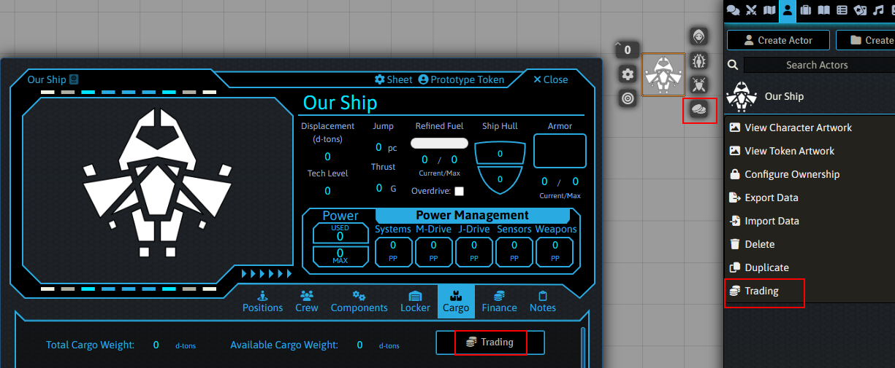

# Space Trader for Foundry VTT - Preliminary Release

A module to automate aspects of trading using the Mongoose Traveller 2nd Edition (2022 Core Rulebook Update) rules in the TwoDSix system.  This functionality is attached to starship actors and can be accessed for each actor via the methods highlighted in the image below.

## Note on Version Numbers
The initial test release of this was supposed to be version 0.5.0 but I messed up and left the internal version numbering at 1.0.0.  If I changed it to a lower number, testers would have to uninstall and reinstall the module.  Rather than doing that, I'm just going to leave the numbering at 1.0.x even though it's not yet at full release.

## Documentation
(Coming soon)
- Installation
- Module Settings
- Settings Tab
- Passengers
- Freight and Mail
- Speculative Trading

## What's Implemented
This initial release implements passenger availabilty, standard freight, and mail.  It's being made available for testing and feedback.

## What's Coming
Speculative trading - both the buying and selling sides - are in progress and will be added before the full release.

## License
Released under the very precisely defined "Mongoose told me on their forum to go ahead for now but they reserve the right to change their mind" license.  For this reason there's a non-trivial likelihood that Foundry won't add it to their official module list, and of course if Mongoose ever slaps my hand and says "Stop that!", I'll have to take it offline.  (Foundry doesn't appear to be on their radar at all in terms of official support, so it's unlikely to directly compete with anything of theirs.)

## Support
Questions, suggestions, and feedback can be directed to @drl2 on the [Foundry TwoDSix Discord](https://discord.gg/5Qx2ACQQgP).  (Note that I'm not affiliated with site or its admins at all.)

## The Other Kind of Support
This project is free and open source, but if you're feeling generous and would like to Toss A Coin to your Coder (try explaining that one when somebody reads this in five years!), there a a few ways to do so:

- Donate via [ko-fi](https://ko-fi.com/drl2461951)
- Buy stuff through my [DriveThruRPG affiliate link](https://www.drivethrurpg.com/?affiliate_id=1692486)
- Use this [Amazon link](https://amzn.to/3kGDqgc) when you're planning to make a purchase from that particular giant evil megacorp.
- Stop in to read my occasional [gaming blog](https://gaming.drl2.com) once in a while.  

